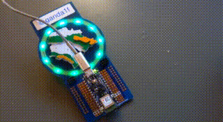

# Make Zurich 2020 badge audio sensor demo

## Features
- Periodically read the MP34DT05-A audio sensor
- Control the MZ2020 badge lights accordingly

## Requirements
Depends on the following Arduino libraries to be installed
(Tools -> Manage Libraries)
- Adafruit_Neopixel
